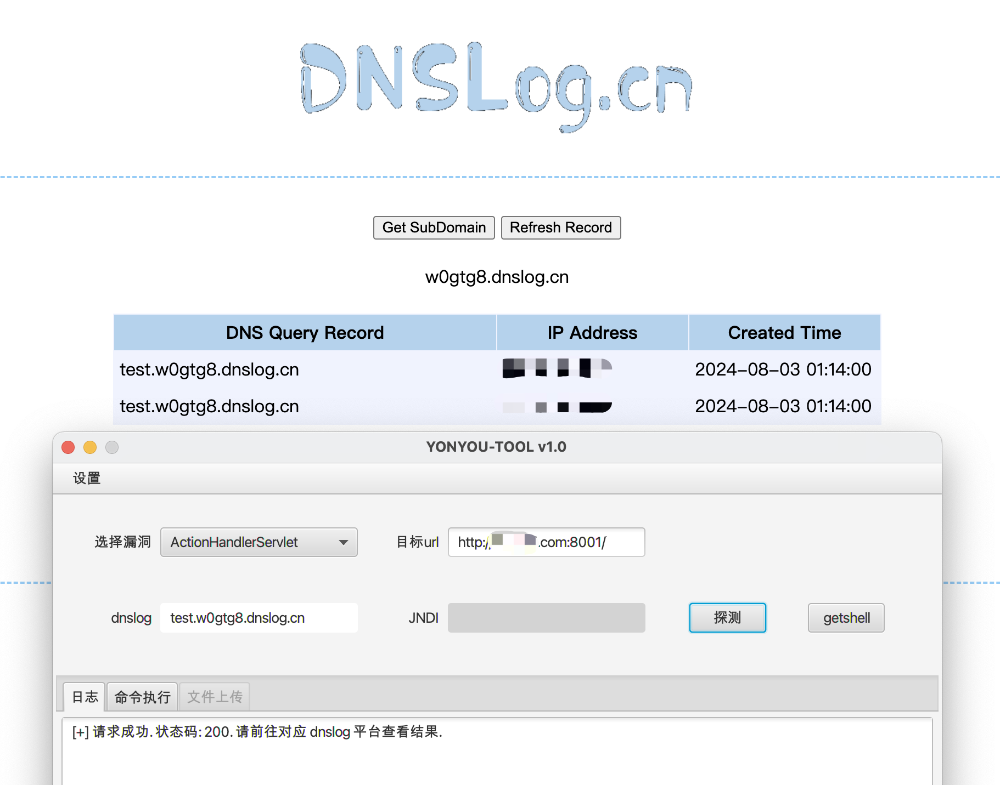
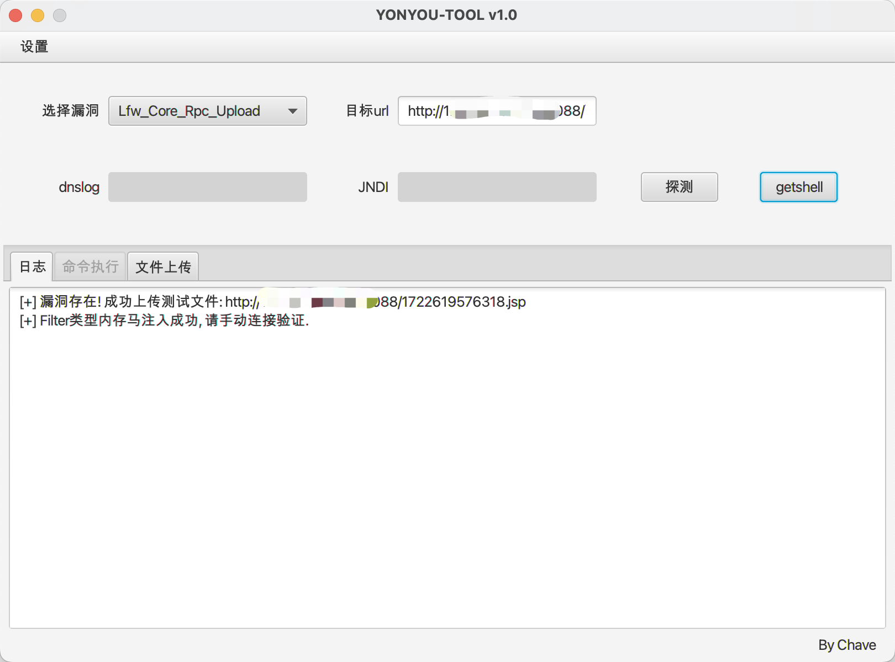
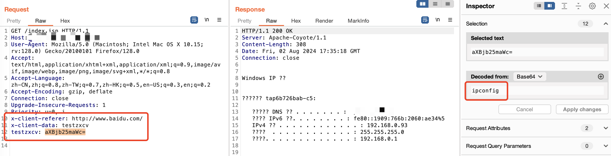
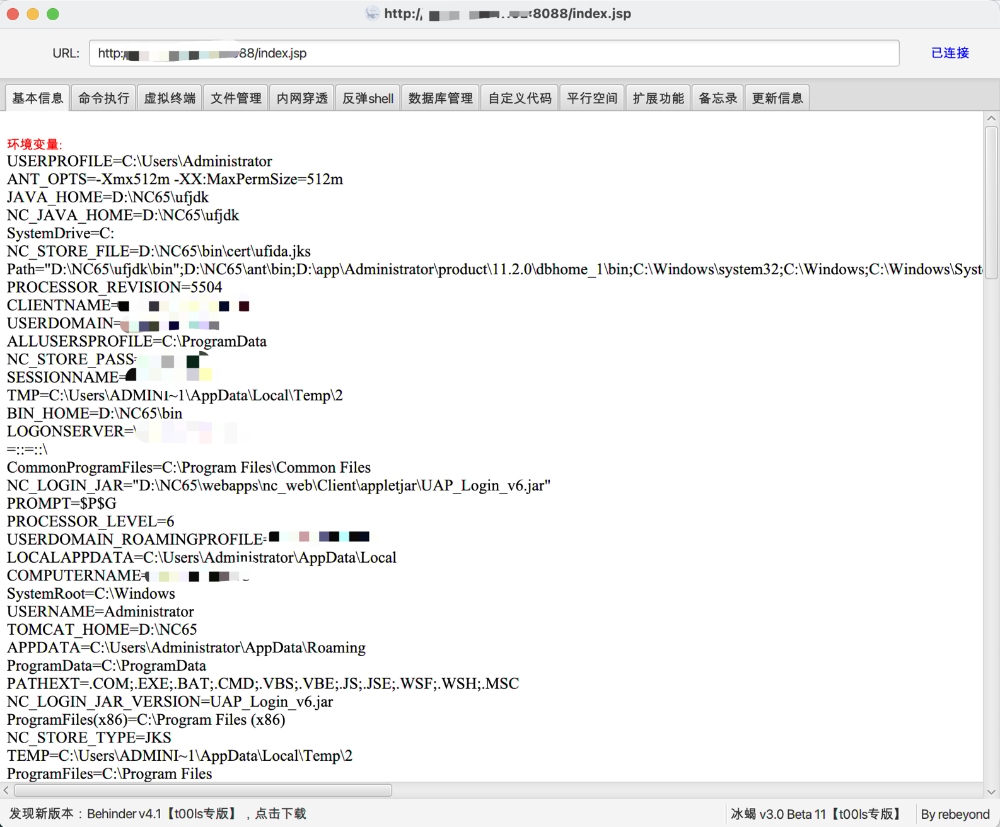
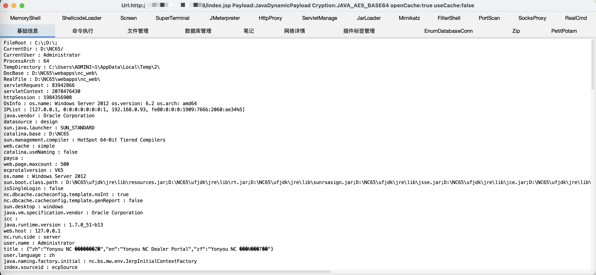
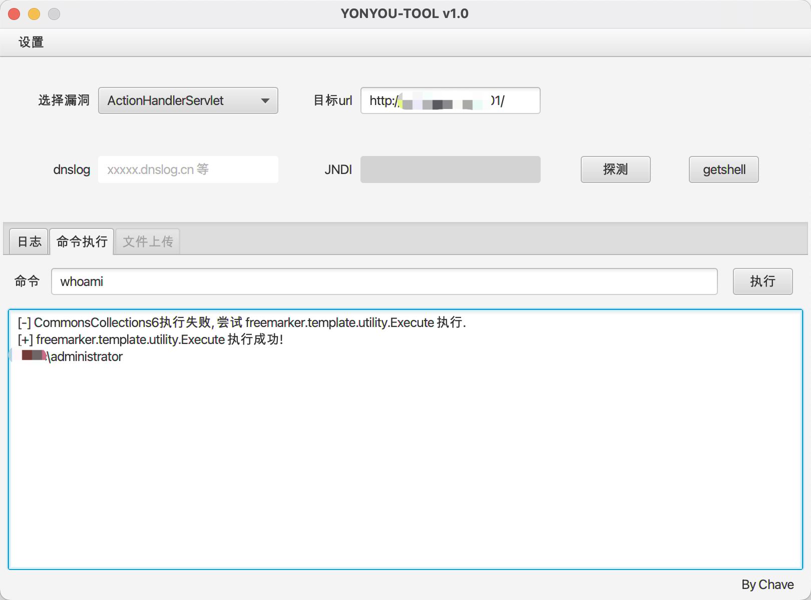
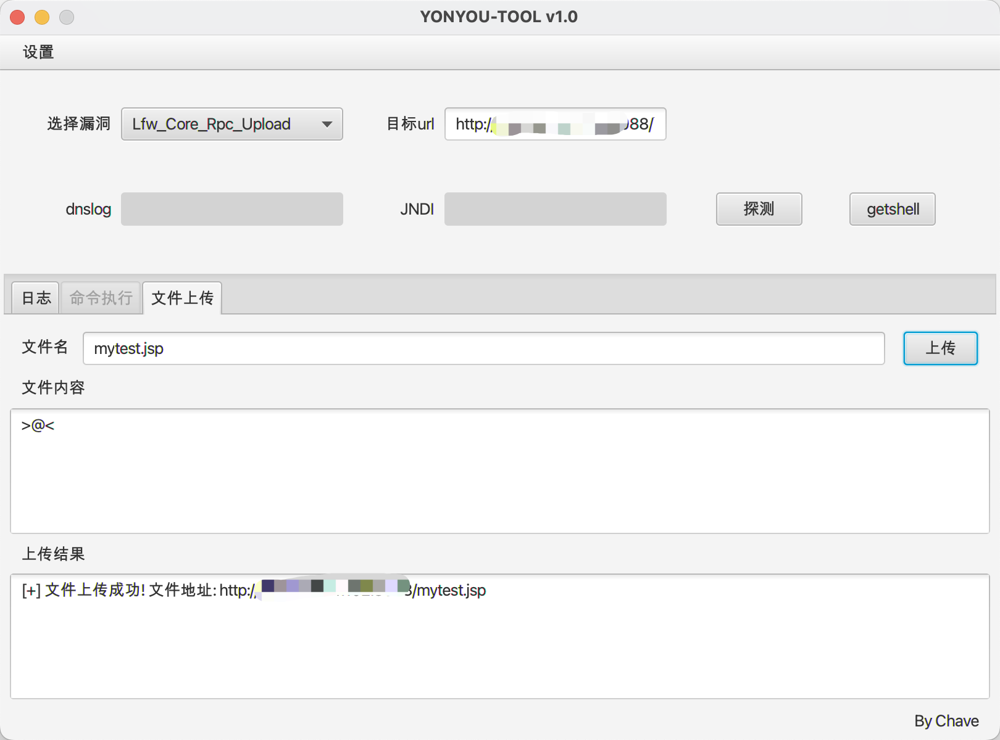
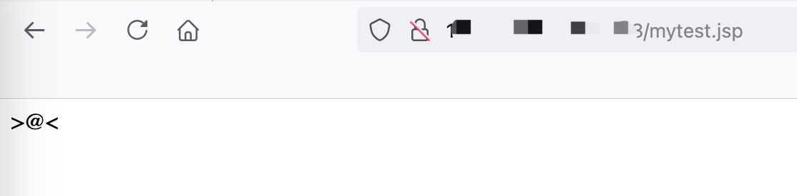

# YONYOU-TOOL

用友漏洞一键探测利用。

学习用友漏洞期间一时兴起，写一款工具记录学习。

工具开发期间，感谢 **SpringKill** 师傅指点。

## 免责声明

本工具仅适用于安全研究学习，严禁使用本工具发起网络黑客攻击，造成法律后果，请使用者自负。

## 支持漏洞

```
ActionHandlerServlet 反序列化
Lfw_Core_Rpc 文件上传
BshServlet RCE
jsinvoke 文件上传
accept.jsp 文件上传
DeleteServlet 反序列化
MxServlet 反序列化
DownloadServlet 反序列化
FileReceiveServlet 反序列化
Fs_Update_DownloadServlet 反序列化
MonitorServlet 反序列化
UploadServlet 反序列化
NCMessageServlet 反序列化
XbrlPersistenceServlet 反序列化
ECFileManageServlet 反序列化
ModelHandleServlet 反序列化
ResourceManager 反序列化
```

## 使用说明

java -jar 启动。

```
java -jar YONYOU-TOOL-[version].jar
```

目前实现功能模块：漏洞探测、一键 getshell、命令执行、文件上传。


### 漏洞探测

以 **ActionHandlerServlet 反序列化** 漏洞为例。

选择漏洞，填写必要信息，点击探测，可自行在 dnslog 平台查看结果。



### 一键 getshell

本工具一键 getshell 功能打入的 webshell 同时打入回显、冰蝎、哥斯拉。请求头与连接密码信息均为下方所示。

```
Filter 内存马连接地址：http://x.x.x.x/...网站目录.../*
--------------------------------------------------------------------------------------------
回显
添加请求头
x-client-referer:http://www.baidu.com/
x-client-data:testzxcv
testzxcv:<base64编码后命令>
--------------------------------------------------------------------------------------------
冰蝎
添加请求头
x-client-referer:http://www.baidu.com/
x-client-data:behinder
密码
chaveyyds
--------------------------------------------------------------------------------------------
哥斯拉
添加请求头
x-client-referer:http://www.baidu.com/
x-client-data:godzilla
密钥
chaveyyds
密码
pass
```

以 **Lfw_Core_Rpc 文件上传** 漏洞为例。

选择漏洞，输入目标url，点击 getshell。



根据连接信息连接利用即可。







### 命令执行

以 **ActionServletHandler 反序列化** 漏洞为例。

进入 **命令执行** 模块，输入命令，点击执行即可，目前该漏洞已支持 **CC6** 与 **freemarker.template.utility.Execute** 两种命令执行。



### 文件上传

以 **Lfw_Core_Rpc 文件上传** 漏洞为例。

选择漏洞，进入文件上传模块，输入文件名，文件内容，点击上传即可。





## 更新记录

### 20240724

- v1.0 版本发布，命令行工具版本。
- 支持 **ActionServletHandler 反序列化** 漏洞探测利用。

### 20240803

- v2.0 版本发布，实现图形化。
- 新增命令执行回显模块。
- 新增文件上传模块。
- 支持 **Lfw_Core_Rpc 文件上传** 漏洞探测利用。

### 20240804

- 新增设置超时时间功能。
- 支持 **BshServlet RCE** 漏洞探测利用。

### 20240805

- 新增一键探测所有漏洞功能。
- 支持 **jsinvoke 文件上传** 漏洞探测利用。
- 修复 bug。

### 20240809

- v2.0.3-beta 版本，修复部分 bug，剩余 bug 将在 v2.0.3 正式版本完成修复。
- 支持 **accept.jsp 文件上传** 漏洞探测利用。

### 20240810

- 修复 **accept.jsp 文件上传** 部分站点无法一键 getshell 问题，已做适当免杀处理。
- 修复 **accept.jsp 文件上传** 文件上传功能日志信息显示位置错误问题。
- 修复 **BshServlet RCE** 文件上传功能编码问题。
- 修复 **Lfw_Core_Rpc 文件上传** 文件上传功能编码问题。
- 修复目标 URL **存在空格**、**无端口号**、**输入带路径 URL** 时处理异常问题。

### 20240811

- 支持 **jsinvoke 文件上传** 命令执行功能。
- 修复 **jsinvoke 文件上传** 无法一键 getshell 问题。

### 20240814

- 支持 **DeleteServlet 反序列化** 漏洞探测利用。

### 20240817

- 支持以下漏洞探测利用：
  - **MxServlet 反序列化**
  - **DownloadServlet 反序列化**
  - **FileReceiveServlet 反序列化**
  - **Fs_Update_DownloadServlet 反序列化**
  - **MonitorServlet 反序列化**
  - **UploadServlet 反序列化**
  - **NCMessageServlet 反序列化**
  - **XbrlPersistenceServlet 反序列化**
  - **ECFileManageServlet 反序列化**
  - **ModelHandleServlet 反序列化**
  - **ResourceManager 反序列化**
- 优化部分功能。

## 最后

开发过程中参考相关漏洞利用工具：

- https://github.com/wafinfo/NCTOOls

- https://github.com/R4gd0ll/I-Wanna-Get-All

工具以记录自己学习为主，本人佛系更新。

工具开源，有需要可自行在 com.chave.vuln 包内添加漏洞 poc。
